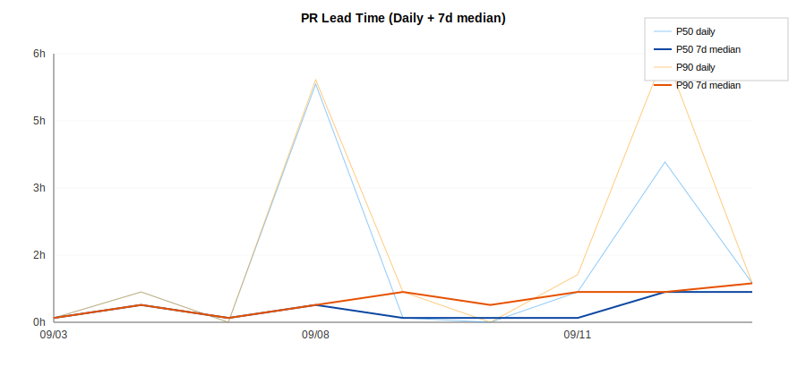

# Cloud Starter

A transparent learning project to practice Product Ownership and disciplined delivery.  
**Product Goal:** Enable developers to self-serve a few on-demand servers for tests within minutes.

---

## Sprint 3 — Hardened Live Path & UX

**Sprint Goal:** Harden the **live path** and improve **UX** for `spin`:  
- Resolve latest AL2023 AMI via SSM  
- Add bounded waiters for instance readiness  
- Add human-friendly `--table` output for `up | status | down`  
- Enrich `status` with **health** and **uptime**  
- Add bounded waiter + summary for `down`

### Scope (Committed P0s)

- **`feat(up)`: resolve AL2023 AMI via SSM**  
  - AMI resolved from SSM Parameter Store (`/aws/service/ami-amazon-linux-latest/al2023-ami-kernel-6.1-x86_64`).  
  - Fail fast with clear, actionable error if missing/unsupported.  
  - Tested via moto + unit tests.

- **`feat(up)`: bounded waiter + `--table` output**  
  - After `up --apply`, wait until instances are **running** or **timeout (~90s)**.  
  - Exit code non-zero on timeout with guidance.  
  - Default output = JSON; with `--table`, print:  
    ```
    InstanceId | PublicIp | State | SpinGroup
    ```

- **`feat(status)`: health + uptime + `--table`**  
  - `status` enriches with `health` (`OK | IMPAIRED | INITIALIZING | UNKNOWN`) and `uptime_min` (minutes since LaunchTime).  
  - JSON remains default; `--table` prints:  
    ```
    InstanceId | State | Health | Uptime(min) | SpinGroup
    ```

- **`feat(down)`: table output**  
  - Default JSON unchanged.  
  - With `--table`, print:  
    ```
    InstanceId | State
    ```

- **`feat(down)`: bounded waiter + friendly summary**  
  - After `down --apply`, wait until instances are **terminated** or **timeout (~90s)**.  
  - Exit code non-zero on timeout with guidance.  
  - JSON includes `"warning"` field if timeout.  
  - Table output unchanged.

### Non-goals (not in this sprint)

- Multi-cloud (Azure/GCP), Terraform/IaC  
- SSH/provisioners, IAM hardening  
- Autoscaling, budgets/policies beyond basic teardown  
- Monitoring/alerts  
- Real instance lifecycle beyond the minimal demo  

---

## Prerequisites

- Python **>= 3.11**
- **Owner is required:** set `SPIN_OWNER` to your handle/email
- Default region: **eu-north-1** (override with `SPIN_REGION` or `--region`)
- For live calls (later): configure AWS credentials (`AWS_PROFILE` or `~/.aws`)

---

## Quick start (dev)

```bash
python -m venv .venv
# Windows: .venv\Scripts\activate
source .venv/bin/activate

python -m pip install -U pip
pip install -e .[test]
````

Check the CLI and try dry-run:

```bash
export SPIN_OWNER=@yourhandle
spin --help
spin up --count 2 --table
spin status --table
spin down --group demo --table
```

**Notes**

* With no `--apply` or without `SPIN_LIVE=1`, output is JSON previews and **no AWS calls** are made.
* `spin down` requires `--group` for destructive actions (override via `SPIN_ALLOW_GLOBAL_DOWN=1` only if you really mean it).

---

## Live operations (guarded; optional)

Only when you’re ready and have credentials:

```bash
export SPIN_OWNER=@yourhandle
export SPIN_LIVE=1
spin up --count 1 --apply --table
spin status --table
spin down --group <id> --apply --table
```

---

## Environment variables

* `SPIN_OWNER` (required): logical owner tag.
* `SPIN_REGION` (optional): default region (falls back to `AWS_DEFAULT_REGION` then `eu-north-1`).
* `SPIN_DRY_RUN` (default `1`): when `1`, `status` also avoids AWS.
* `SPIN_LIVE` (default `0`): must be `1` **and** you must pass `--apply` to perform live actions.
* `SPIN_ALLOW_GLOBAL_DOWN` (default `0`): allow `down` without `--group` (dangerous; owner-scoped still).

---

## Run tests

```bash
pytest -q
```

Tests cover dry-run behavior, waiter paths, table outputs, health/uptime enrichment, down waiter/summary, and moto-based roundtrips.

---

## How we work

* **Board:** public Kanban
  [](https://github.com/users/thenarfer/projects/1)
* **Workflow:** WIP=1, short-lived branches, PRs only (squash merge), CI required
* **Working agreements:**

  * [Definition of Ready](docs/DoR.md)
  * [Definition of Done](docs/DoD.md)

### Engineering Metrics

**PR Lead Time (Weekly)**



**Recent Metrics**

| Day | PRs | P50 | P90 |
|-----|-----|-----|-----|
| 2025-09-14 | 1 | 0.9h | 0.9h |
| 2025-09-12 | 2 | 3.7h | 6.2h |
| 2025-09-11 | 2 | 0.7h | 1.1h |
| 2025-09-10 | 1 | 0.0h | 0.0h |
| 2025-09-09 | 3 | 0.1h | 0.7h |
| 2025-09-08 | 3 | 5.5h | 5.6h |
| 2025-09-07 | 1 | 0.0h | 0.0h |

*Last updated: 2025-09-15 13:54 UTC*

---

## Roadmap (high level)

* **Sprint 3 (this sprint):** AMI resolution, waiter, enriched status, table UX, down waiter/summary

---

## License

MIT
